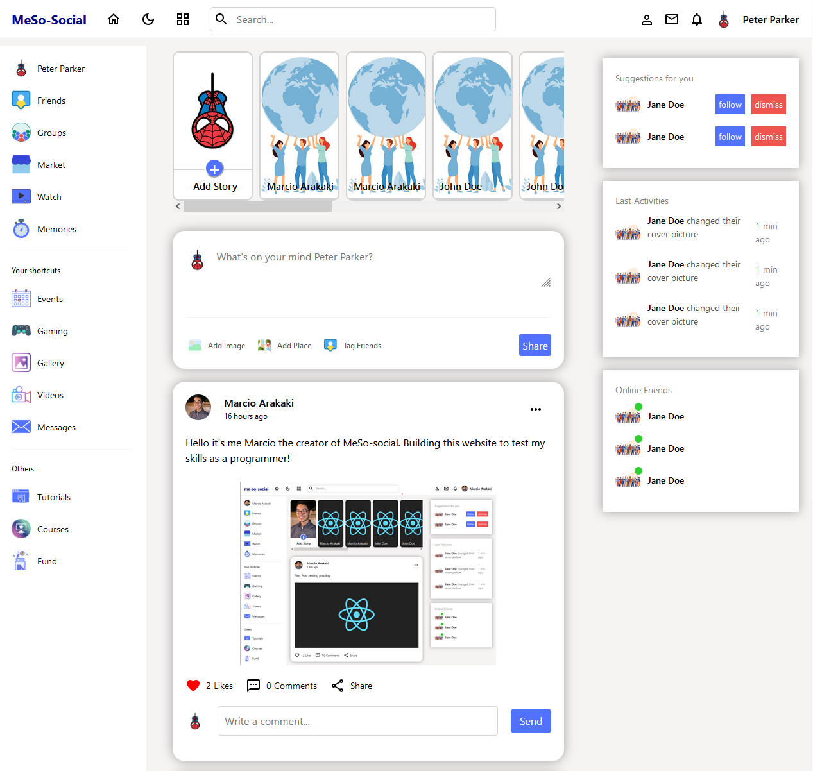
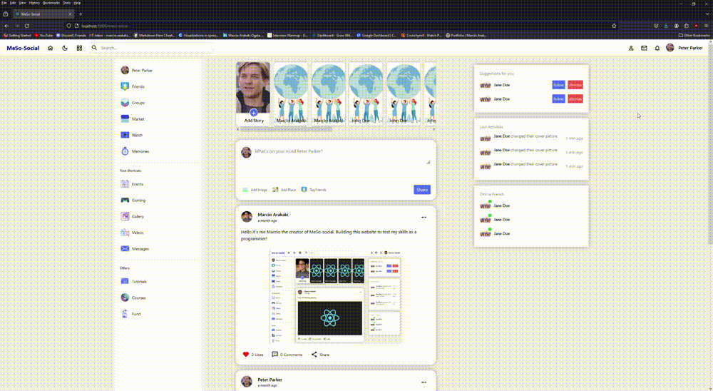
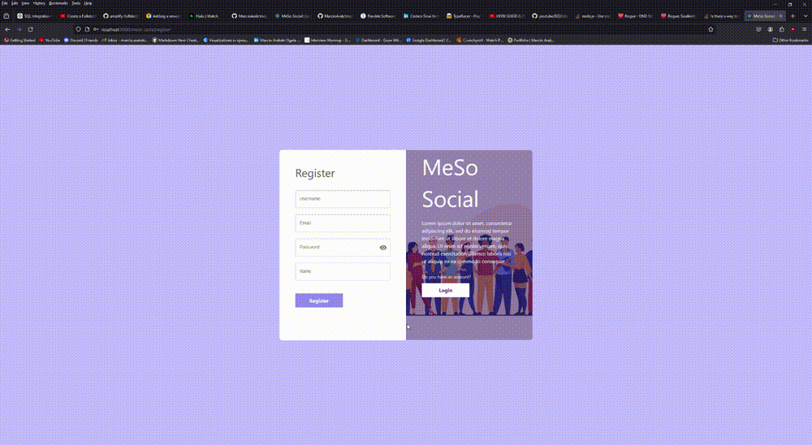
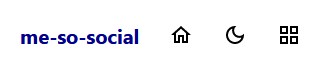
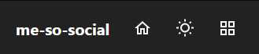

# MeSo-social (Social media React App)

[[Link to website]](https://marcioarak.github.io/meso-social/)

# Overview

This project is a Social Media website made with React. It contains multiple pages such a a login, register, home and profile page. The application is not currently a full stack website as of now but will be in the future.
The application is built using react-router-dom and react hooks.  
The website shows only the front-end with a few functionalities such as:

- Light and Dark theme when clicking the moon or sun button  
    
  
- Logging out when clicking the person button (Temporary)
- Able to click to your profile (but no editing)
- Respnsive layout (mobile and tablet friendly

## Futures implementations:

- Make a database to register users
- Functionality to post pictures or text posts
- Add a function to comment on people's post
- Add a fucntionality to follow and unfollow people
- Edit profile box (name, location and website)
