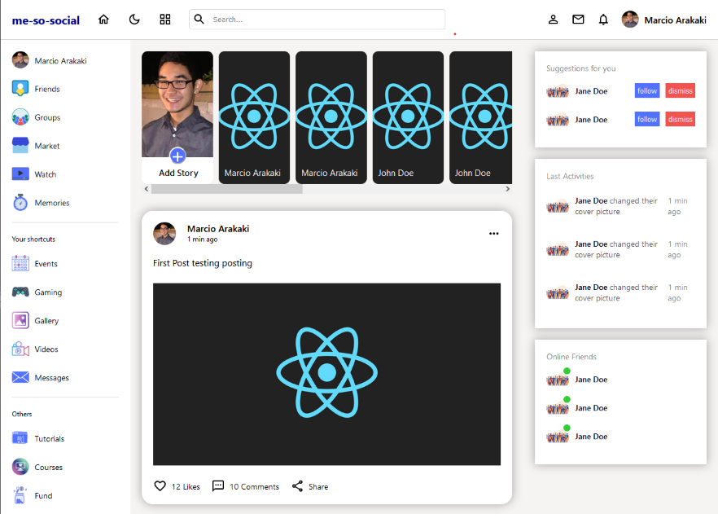
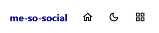
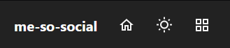

# MeSo-social (Social media React App)

[[Link to website]](https://marcioarak.github.io/me-so-social/)

# Overview

This project is a Social Media website made with React. It contains multiple pages such a a login, register, home and profile page. The application is not currently a full stack website as of now but will be in the future.
The website shows only the front-end with a few functionalities such as:
* Light and Dark theme when clicking the moon or sun button  
    
  
* Logging out when clicking the person button (Temporary)
* Able to click to your profile (but no editing)

The application also has a responsive layout depending on the device. It is mobile and tablet friendly. It is built using react-router-dom and react hooks.
As of now you can only login as myself because everything is hard coded, but will change it in the future to add users and connect it to a database.
To view the homepage the login button must be clicked but no information is recorded.

## Futures updates include:
* Make a database to register users
* Functionality to post pictures or text posts
* Add a function to comment on people's post
* Add a fucntionality to follow and unfollow people
* Edit profile box (name, location and website)
