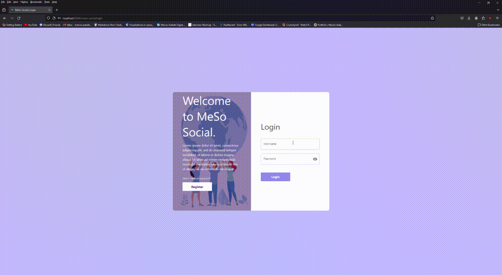

# MeSo-social (Social-Media React App)

## Overview

This project is a social media website developed using React, featuring multiple pages including login, registration, home, and profile pages. The application incorporates both client and server sides, connected to a local database. Users can register, log in, and follow other users, enhancing the social networking experience.

This application is designed to facilitate social interaction by allowing users to post images or text messages. Other users can engage with these posts through likes and comments, fostering a dynamic and interactive community environment

## Functionalities:

- Register / Login
- Post images / Delete posts
- Like / Unlike posts
- Comments on posts

- Update profile pictures and other info
- Update or change username and password
- Edit posts

- Light and Dark theme

- Responsive layout (mobile / iPad)

# Technologies:

- React
- MySQL

## Futures implementations:

- Deploy app as a fullstack website
